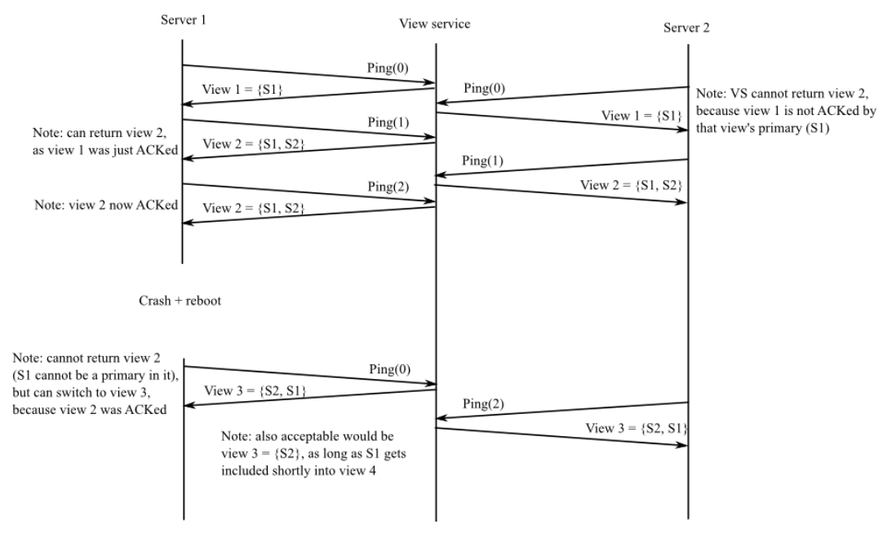

# Lab 2: Primary/Backup Key/Value Service

## Introduction

Welcome to Lab 2! This lab introduces you to **fault-tolerant distributed systems** by building a replicated key-value service. Unlike the MapReduce lab where workers were stateless, here we'll make servers with persistent state fault-tolerant.

**What you'll learn:**
- How to design primary/backup replication systems
- How to handle server failures and network partitions
- How to ensure consistency in distributed systems
- How to implement view services for coordination

## Learning Path: Labs 2-4 Overview

Over the next three labs, you'll build increasingly sophisticated key-value services. Each lab builds upon the previous one:

### Lab 2: Primary/Backup Replication (This Lab)
- **Goal**: Basic fault tolerance with primary/backup replication
- **Features**: Simple replication, view service coordination
- **Limitations**: Single point of failure (view service), limited performance

### Lab 3: Paxos-Based Replication
- **Goal**: Eliminate single points of failure
- **Features**: Paxos consensus protocol, no single point of failure
- **Trade-off**: Lower performance but higher fault tolerance

### Lab 4: Sharded Distributed System
- **Goal**: Scale to thousands of servers
- **Features**: Horizontal scaling, parallel operations, dynamic rebalancing
- **Result**: Production-ready distributed system design

## Key-Value Service API

Your service will support three operations:

```go
// Store a key-value pair
Put(key, value) -> void

// Store with hash chaining (useful for testing)
PutHash(key, value) -> previous_value

// Retrieve a value
Get(key) -> value
```

**Important Notes:**
- `PutHash` chains values together: `new_value = hash(old_value + new_value)`
- All data is stored in memory (no persistence)
- The service maintains a simple key-value database

## Design Philosophy

**Think Before You Code!** This lab requires substantial design work. You'll need to:
1. Design a complete replication protocol
2. Handle various failure scenarios
3. Ensure consistency guarantees
4. Test your design thoroughly

The test cases will reveal flaws in your design - this is expected and part of the learning process. Don't be discouraged if you need to redesign; this mirrors real-world distributed systems development.

## Lab 2 Architecture Overview

### The Primary/Backup Replication Model

This lab implements **primary/backup replication** with a **view service** for coordination. Here's how it works:

```
┌─────────────┐    ┌─────────────┐    ┌─────────────┐
│   Client    │    │   Client    │    │   Client    │
└──────┬──────┘    └──────┬──────┘    └──────┬──────┘
       │                  │                  │
       └──────────────────┼──────────────────┘
                          │
                    ┌─────▼──────┐
                    │View Service│ ◄── Monitors server health
                    └────────────┘
                          │
       ┌──────────────────┼──────────────────┐
       │                  │                  │
┌──────▼──────┐    ┌──────▼──────┐    ┌──────▼──────┐
│   Primary   │◄──►│   Backup    │    │  Idle Server│
│   Server    │    │   Server    │    │             │
└─────────────┘    └─────────────┘    └─────────────┘
```

### Key Components

1. **View Service**: The "brain" of the system
   - Monitors which servers are alive/dead
   - Decides which server is primary and which is backup
   - Coordinates view transitions when servers fail
   - **Single point of failure** (we'll fix this in Lab 3)

2. **Primary Server**: Handles all client requests
   - Processes Get/Put operations
   - Replicates all operations to backup
   - Maintains the authoritative copy of data

3. **Backup Server**: Standby replica
   - Receives all operations from primary
   - Takes over if primary fails
   - Must be kept in sync with primary

4. **Idle Servers**: Available but not active
   - Can be promoted to backup when needed
   - Ping the view service to stay available

### Critical Design Requirements

**Split-Brain Prevention**: The primary must forward **both Gets and Puts** to the backup and wait for acknowledgment. This prevents two servers from acting as primary simultaneously.

**Example Scenario**:
1. S1 is primary, S2 is backup
2. View service thinks S1 is dead, promotes S2 to primary
3. Client still thinks S1 is primary and sends operation
4. S1 forwards to S2, S2 rejects (no longer backup)
5. S1 realizes it's no longer primary, returns error to client
6. Client asks view service for current primary (S2)

### System Limitations (By Design)

This lab intentionally has limitations that we'll address in later labs:

- **View service is not replicated** → Single point of failure
- **Sequential processing** → Limited performance
- **Full state transfer** → Slow recovery
- **Memory-only storage** → No crash recovery
- **Network partition handling** → Limited options
- **Acknowledgment deadlock** → Can get stuck

**Why these limitations?** They help you understand the fundamental challenges in distributed systems. Real-world systems use more sophisticated protocols to address these issues.

### Communication Rules

- **Only RPC allowed** for all communication
- **No shared memory** or files between server instances
- **No direct server-to-server communication** (except through view service)

### Related Work and References

This lab's design draws inspiration from several real-world systems:

- **[Flat Datacenter Storage](https://www.usenix.org/system/files/conference/osdi12/osdi12-final-75.pdf)**: Similar metadata server architecture
- **[MongoDB Replica Sets](https://docs.mongodb.com/manual/replication/)**: Primary/backup with automatic failover
- **[Chain Replication](http://www.cs.cornell.edu/home/rvr/papers/osdi04.pdf)**: High-performance replication protocol
- **[Harp](http://www.pmg.csail.mit.edu/papers/harp.pdf)**: High-performance primary/backup systems
- **[Viewstamped Replication](http://pmg.csail.mit.edu/papers/vr-revisited.pdf)**: Consensus-based replication

## Getting Started

### Project Structure

```
src/
├── viewservice/          # Part A: View service implementation
│   ├── common.go         # RPC definitions and constants
│   ├── server.go         # View service server (YOU IMPLEMENT)
│   ├── client.go         # View service client (provided)
│   └── test_test.go      # Test cases
├── pbservice/            # Part B: Primary/backup service
│   ├── common.go         # RPC definitions
│   ├── server.go         # Primary/backup server (YOU IMPLEMENT)
│   ├── client.go         # Primary/backup client (provided)
│   └── test_test.go      # Test cases
└── main/                 # Standalone applications
    ├── viewd.go          # View service daemon
    ├── pbd.go            # Primary/backup daemon
    └── pbc.go            # Client application
```

### Quick Start

1. **Build the applications**:
   ```bash
   go build viewd.go
   go build pbd.go  
   go build pbc.go
   ```

2. **Start the system**:
   ```bash
   ./viewd /tmp/viewservice-socket &
   ./pbd /tmp/viewservice-socket /tmp/pbserver-1 &
   ./pbd /tmp/viewservice-socket /tmp/pbserver-2 &
   ```

3. **Test the system**:
   ```bash
   ./pbc /tmp/viewservice-socket key1 value1    # Put
   ./pbc /tmp/viewservice-socket key1           # Get
   ```

### Testing Your Implementation

**Run the tests**:
```bash
cd src/viewservice
go test -v
```

**Expected initial output** (tests will fail until you implement the server):
```
=== RUN   Test1
Test: First primary ...
  ... FAILED
Test: First backup ...
  ... FAILED
...
```

**Note**: Ignore the "method Kill has wrong number of ins" error message - this is expected and harmless.

The tests fail initially because `viewservice/server.go` has empty RPC handlers that you need to implement.

## Part A: The View Service

### Overview

The **view service** is the coordinator that manages the primary/backup system. It's not replicated itself (single point of failure), but it's relatively simple to implement.

**Your task**: Implement the view service in `src/viewservice/server.go`

### View Service Concepts

**Views**: The view service maintains a sequence of numbered views. Each view contains:
- **View number**: Sequential identifier (1, 2, 3, ...)
- **Primary server**: The server that handles all client requests
- **Backup server**: The server that replicates from primary (optional)

**View Transitions**: The view service creates new views when:
1. A server fails (primary or backup)
2. A server restarts after a crash
3. An idle server becomes available for backup

### View Service Rules

**Rule 1: Primary Continuity**
- The primary in a new view must be either:
  - The primary from the previous view, OR
  - The backup from the previous view
- **Exception**: When the view service first starts, any server can become the first primary

**Rule 2: Backup Flexibility**
- The backup can be any available server (except the primary)
- The backup can be empty (`""`) if no server is available

**Rule 3: Acknowledgment Requirement**
- The view service cannot create a new view until the current primary acknowledges the current view
- This prevents the view service from getting too far ahead of the servers

### Known Design Flaw

**Deadlock Scenario**: If the primary fails in a view with no backup, the view service cannot make progress because:
1. No backup exists to promote to primary
2. The view service cannot create a new view until the (dead) primary acknowledges
3. The system gets stuck

This is intentional - it demonstrates a fundamental challenge in distributed systems that we'll address in later labs.

### Ping Protocol

**How servers communicate with the view service**:

1. **Regular Pings**: Servers send `Ping(viewnum)` every `PingInterval` (100ms)
   - `viewnum`: The server's current view number
   - Purpose: "I'm alive and operating in view X"

2. **Crash Recovery**: Servers send `Ping(0)` after restarting
   - `viewnum = 0`: "I crashed and restarted"
   - Purpose: Signal that the server needs to be reinitialized

3. **View Updates**: The view service replies with the current view
   - Servers learn about view changes through ping responses
   - Servers must acknowledge new views before the view service can proceed

### View Transition Triggers

The view service creates a new view when:

1. **Server Timeout**: No ping received from primary/backup for `DeadPings` intervals (5 intervals = 500ms)
2. **Server Restart**: Primary or backup sends `Ping(0)` (crash recovery)
3. **Backup Promotion**: No backup exists and an idle server is available

### Acknowledgment Protocol

**Critical Rule**: The view service cannot create a new view until the current primary acknowledges the current view.

**Why this matters**:
- Prevents the view service from getting too far ahead
- Ensures servers don't miss view transitions
- Maintains consistency across the system

**The Problem**: If the primary fails before acknowledging a view, the view service gets stuck and cannot make progress. This is a known limitation of this design.

### Example View Transition Sequence



**Key Points**:
- Servers may not immediately switch to new views
- The view service waits for primary acknowledgment before proceeding
- View transitions happen asynchronously across servers

### Implementation Hints

**What you need to implement in `server.go`**:

1. **ViewServer struct**: Add fields to track:
   - Current view (number, primary, backup)
   - Acknowledgment status
   - Server health tracking
   - Tick counter

2. **Ping RPC handler**: Process server pings and manage view transitions

3. **Get RPC handler**: Return current view to clients

4. **tick() function**: Periodic health checking and view transitions

**Key data structures you'll need**:
```go
type ViewServer struct {
    // ... existing fields ...
    current View           // Current view state
    ack     bool           // Has current view been acknowledged?
    pings   map[string]int // Last ping time for each server
    ticks   int            // Current tick counter
}
```

### Testing Your Implementation

**Run the tests**:
```bash
cd src/viewservice
go test -v
```

**Expected output when working**:
```
=== RUN   Test1
Test: First primary ...
  ... Passed
Test: First backup ...
  ... Passed
Test: Backup takes over if primary fails ...
  ... Passed
Test: Restarted server becomes backup ...
  ... Passed
Test: Idle third server becomes backup if primary fails ...
  ... Passed
Test: Restarted primary treated as dead ...
  ... Passed
Test: Viewserver waits for primary to ack view ...
  ... Passed
Test: Uninitialized server cant become primary ...
  ... Passed
PASS
ok      viewservice     7.457s
```

**Note**: Some benign Go RPC errors may appear in the output - these are expected and can be ignored.

### Detailed Implementation Hints

**State Machine Design**
- Think of your view service as a state machine
- States: "no primary", "primary only", "primary + backup", "transitioning"
- Events: server pings, timeouts, acknowledgments
- Use switch statements to handle different server roles and ping types

**Data Structures You'll Need**
```go
type ViewServer struct {
    // ... existing fields ...
    current View           // Current view state
    ack     bool           // Has current view been acknowledged?
    pings   map[string]int // Last ping tick for each server
    ticks   int            // Current tick counter
}
```

**Time Management**
- Use tick-based timing instead of `time.Now()`
- Track last ping time as tick numbers, not timestamps
- `tick()` function increments the counter and checks for timeouts

**View Transition Logic**
- Primary continuity: new primary must be old primary OR old backup
- Acknowledgment requirement: can't create new view until current primary acks
- Backup promotion: promote idle server when backup slot is empty

**Edge Cases to Handle**
- First server becomes primary (view 1)
- Server restart detection (`Ping(0)`)
- Multiple idle servers (pick one for backup)
- Deadlock scenarios (primary fails before ack)

**Debugging Tips**
- Add `log.Printf()` statements to trace execution
- Run tests with `go test > out 2>&1` to capture all output
- Compare your understanding with actual behavior
- Use the mutex (`mu`) to protect shared data structures

**Performance Notes**
- RPC handlers run in separate goroutines
- Use mutex to synchronize access to shared state
- `tick()` function runs periodically in background
- Tests may kill servers by setting `dead` flag

**Code Size Expectation**
- Part A should require approximately 130 lines of code
- Focus on correctness over optimization
- The view service is simpler than the primary/backup service

## Part B: Primary/Backup Service (Coming Next)

**Note**: Part B is significantly more complex than Part A. The primary/backup service must:
- Handle client requests (Get, Put, PutHash)
- Replicate operations between primary and backup
- Coordinate with the view service
- Handle view transitions gracefully
- Ensure consistency across failures

**Key challenges in Part B**:
- Split-brain prevention
- State synchronization
- View transition handling
- Client request forwarding
- Error handling and recovery

**Preparation for Part B**:
- Make sure Part A is working perfectly
- Understand the view service protocol thoroughly
- Study the test cases to understand expected behavior
- Plan your replication protocol carefully

---

## Summary

**What you've learned**:
- How to design a view service for distributed coordination
- How to handle server failures and view transitions
- How to implement acknowledgment protocols
- How to debug distributed systems

**Next steps**:
1. Implement the view service in `src/viewservice/server.go`
2. Run the tests until they all pass
3. Move on to Part B (primary/backup service)

**Remember**: This lab is about understanding the fundamental challenges in distributed systems. The limitations you encounter are intentional and will be addressed in later labs with more sophisticated protocols. 
