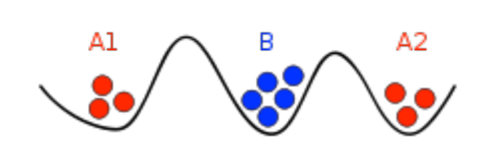

# Introduction to Distributed Systems

## What Are Distributed Systems and Why Do They Matter?

Imagine you're trying to build something massive - like a global social network, an e-commerce platform, or a streaming service. You quickly realize that no single computer can handle the load. This is where distributed systems come in.

**Distributed systems** are collections of computers that work together as a team to accomplish tasks that would be impossible, impractical, or inefficient for any single machine to handle alone.

Think of it like this: instead of one supercomputer doing everything, you have many regular computers working together, each handling a piece of the puzzle. It's like having a team of specialists rather than one person trying to do everything.

## The Core Challenge: Coordination Without Central Control

The fundamental challenge of distributed systems is simple to state but incredibly complex to solve: **How do you make multiple independent computers work together reliably when you can't trust any single one?**

This is harder than it sounds because:

1. **Networks are unreliable** - Messages get lost, delayed, or arrive out of order
2. **Computers fail independently** - One machine crashing shouldn't bring down the whole system
3. **Time is relative** - Different machines may have different ideas about what "now" means
4. **Scale creates complexity** - Adding more machines often creates more problems than it solves

## Why Distributed Systems Are Everywhere

You interact with distributed systems every day, often without realizing it:

- **Google Search**: When you search for something, your query might be processed by dozens of machines across multiple data centers
- **Netflix**: The movie you're watching is streamed from servers distributed around the world
- **Online Banking**: Your account information is replicated across multiple systems for safety and availability
- **Social Media**: Your posts are stored and served from a network of interconnected servers

## The Four Pillars of Distributed Systems

To build a robust distributed system, you need to solve four fundamental problems:

### 1. **Correctness** - "Does it do the right thing?"
Even when things go wrong, the system must maintain data consistency and logical correctness. If you transfer money between bank accounts, the total amount of money in the system should remain the same, regardless of network failures or server crashes.

### 2. **Efficiency** - "Does it perform well?"
The system should be fast and resource-efficient. Adding more machines should improve performance, not make it worse. This is trickier than it sounds - sometimes adding machines can actually slow things down due to coordination overhead.

### 3. **Scale** - "Can it handle growth?"
The system should work whether you have 10 users or 10 million users. This means the architecture must be designed to grow horizontally (adding more machines) rather than just vertically (making individual machines more powerful).

### 4. **Availability** - "Is it always accessible?"
The system should be available even when individual components fail. This is often measured in "nines" - 99.9% uptime means the system is down for about 8.76 hours per year, while 99.99% means only 52.6 minutes of downtime per year.

## The Pessimistic Reality: Why Distributed Systems Are Hard

Leslie Lamport, a pioneer in distributed systems, famously said:
> "A distributed system is one where you can't get your work done because some machine you've never heard of is broken."

This captures the essence of the problem: in a distributed system, failures are not just possible - they're inevitable. When you have hundreds or thousands of machines, something is always broken somewhere.

### The Eight Fallacies of Distributed Computing

Early distributed systems designers made several assumptions that turned out to be wrong:

1. **The network is reliable** - Networks fail more often than you think
2. **Latency is zero** - Even fast networks have delays that matter
3. **Bandwidth is infinite** - Network capacity is always limited
4. **The network is secure** - Security is a constant battle
5. **Topology doesn't change** - Networks evolve and reconfigure
6. **There is one administrator** - Multiple teams manage different parts
7. **Transport cost is zero** - Moving data has real costs
8. **The network is homogeneous** - Different technologies and protocols coexist

## A Classic Problem: The Two Generals Paradox

One of the most famous problems in distributed systems is the **Two Generals Problem**, which demonstrates why achieving perfect coordination is fundamentally impossible in unreliable networks.

### The Scenario
Imagine two armies encamped on hills surrounding a city in a valley. The generals must agree on the exact same time to attack the city. Their only means of communication is sending messengers through the valley, but these messengers can be captured, meaning messages can be lost.

### Why It's Impossible
Here's the paradox: **No solution exists that guarantees both generals will attack simultaneously.**

Let's think through why:
- If a solution exists, it must involve sending some messages
- But the last message could always be lost
- If the last message was essential, losing it would break the plan
- If the last message wasn't essential, we didn't need it in the first place
- We can apply this logic repeatedly, removing all messages
- But with no messages, there's no way to coordinate

### The Deeper Lesson
This problem teaches us that **"common knowledge" cannot be achieved through unreliable communication channels**. In distributed systems, this means:
- You can never be 100% certain that another node knows something
- All coordination protocols have some probability of failure
- Perfect consensus is theoretically impossible in the presence of network failures

## Why We Need Distributed Systems: The Technical Drivers

### 1. **Geographic Distribution**
Modern applications serve users worldwide. With 2.3 billion smartphone users, **locality matters**. A user in Tokyo shouldn't wait 200ms for a response from a server in New York. Distributed systems place data and computation closer to users.

### 2. **Fault Tolerance Through Redundancy**
When one computer fails, the system should continue working. This is impossible with a single machine. Distributed systems achieve reliability through redundancy - if one component fails, others take over.

### 3. **Horizontal Scaling**
Instead of building bigger, more expensive machines (vertical scaling), distributed systems add more machines (horizontal scaling). This approach is more cost-effective and provides better fault tolerance.

### 4. **Specialization and Efficiency**
Different machines can be optimized for different tasks:
- **Storage servers** with lots of disks
- **Compute servers** with powerful CPUs
- **Cache servers** with fast memory
- **Load balancers** for routing traffic

## The End of Dennard Scaling: Why Distributed Computing Became Essential

### What Was Dennard Scaling?
For decades, computer performance improved through **Dennard scaling**: as transistors got smaller, they used proportionally less power. This meant you could pack more transistors without increasing power consumption.

### What Happened?
Around 2005, Dennard scaling broke down. Now, adding more transistors increases power consumption dramatically. This created a fundamental shift:

- **Before**: Make one computer faster by adding transistors
- **Now**: Make many computers work together to achieve the same goal

### The Result
**All large-scale computing is now distributed.** Whether you're running a web service, processing big data, or training AI models, you're using multiple machines working together.

## Real-World Scaling: The Facebook Story

Let's trace how a real system evolved from single-server to distributed:

### 2004: The Beginning
- **Single server** running both web server and database
- Simple architecture, easy to manage
- Limited capacity, but sufficient for early users

### 2008: 100 Million Users
- **Two servers**: one for web, one for database
- **Problem**: System is now offline twice as often!
- Why? Because either server failing brings down the entire system

### 2010-2012: Explosive Growth
- 500 million users, then 1 billion
- **Question**: How do you scale beyond a single server pair?

## Evolution of Distributed Architectures

### Two-Tier Architecture
The first step toward true distribution:

- **Front-end servers**: Handle user requests (stateless)
- **Back-end servers**: Store and manage data
- **Key insight**: If a front-end server crashes, users can reconnect to another one

**Challenges**:
- How do you map users to specific front-end servers?
- How do back-end servers coordinate updates?

### Three-Tier Architecture
Adding a cache layer for better performance:

- **Front-end servers**: Handle user requests
- **Cache servers**: Store frequently accessed data (lower latency)
- **Database servers**: Persistent storage

**Benefits**:
- Faster response times for users
- Reduced load on the database
- Better scalability

**Challenges**:
- How do you keep the cache consistent with the database?
- What happens when cache servers fail?

### Multi-Data Center Architecture
For global scale:

- **Multiple data centers** around the world
- **Cross-continent delays**: ~500ms (half a second)
- **Business impact**: Amazon found that 100ms latency increase reduces sales by 1%

**Architecture**:
- Small data centers: web and cache layers only
- Large data centers: include storage layer
- **Challenge**: How do you coordinate updates across data centers?

## The Reality of Data Center Operations

### A Typical Year in a Large Data Center
Here's what actually happens in production environments:

#### **Major Failures (Rare but Devastating)**
- **Overheating events**: ~0.5 per year
  - Power down most machines in <5 minutes
  - 1-2 days to recover
- **PDU failures**: ~1 per year
  - 500-1000 machines suddenly disappear
  - 6 hours to recover
- **Rack moves**: ~1 per year
  - 500-1000 machines powered down
  - 6 hours to complete

#### **Network Issues (More Frequent)**
- **Rack failures**: ~20 per year
  - 40-80 machines instantly disappear
  - 1-6 hours to restore
- **Network rewiring**: ~1 per year
  - Rolling 5% of machines down over 2 days
- **Router issues**: ~20+ per year
  - Reloads, failures, maintenance

#### **Individual Failures (Constant)**
- **Machine failures**: ~1000 per year
- **Hard drive failures**: ~thousands per year
- **Performance degradation**: slow disks, bad memory, misconfigured machines

### What This Means
**Failure is not the exception - it's the norm.** A distributed system must be designed to handle constant failures gracefully.

## The Properties We Want in Distributed Systems

Based on Google's research and real-world experience, here are the essential properties:

### **Fault-Tolerant**
The system can recover from component failures without performing incorrect actions. If a database server crashes, the system should either:
- Complete the operation correctly using other servers, or
- Fail gracefully without corrupting data

### **Highly Available**
The system can restore operations and resume providing services even when some components have failed. This means:
- Automatic detection of failures
- Automatic recovery procedures
- Graceful degradation of service

### **Consistent**
The system can coordinate actions by multiple components in the presence of:
- **Concurrency**: Multiple operations happening simultaneously
- **Asynchrony**: Operations taking unpredictable amounts of time
- **Failure**: Components that may stop working at any moment

### **Scalable**
The system can operate correctly even as some aspect is scaled to a larger size. This includes:
- **Load scaling**: Handle more users
- **Data scaling**: Store more information
- **Geographic scaling**: Serve more locations

### **Predictable Performance**
The ability to provide desired responsiveness in a timely manner. This means:
- **Latency**: Response time stays within acceptable bounds
- **Throughput**: System can handle expected load
- **Predictability**: Performance doesn't degrade unexpectedly

### **Secure**
The system authenticates access to data and services, protecting against:
- **Unauthorized access**: Only legitimate users can access the system
- **Data breaches**: Sensitive information is protected
- **Service attacks**: The system resists malicious attempts to disrupt service

## The Trade-offs: There's No Free Lunch

Building distributed systems involves fundamental trade-offs that you can't avoid:

### **Consistency vs. Availability**
- **Strong consistency**: All nodes see the same data at the same time
- **High availability**: System continues working even when some nodes fail
- **The CAP theorem**: You can't have all three of consistency, availability, and partition tolerance

### **Latency vs. Throughput**
- **Low latency**: Fast response times for individual requests
- **High throughput**: Handle many requests simultaneously
- **Optimizing for one often hurts the other**

### **Complexity vs. Reliability**
- **More reliable systems** are usually more complex
- **Simple systems** are easier to understand but harder to make robust
- **The sweet spot**: Enough complexity to solve the problem, but not so much that it becomes unmanageable

### **Cost vs. Performance**
- **Better performance** usually means higher costs
- **Redundancy** improves reliability but increases expenses
- **The goal**: Find the right balance for your use case

## Building Intuition: Think Like a Distributed System Designer

To understand distributed systems, start thinking in terms of:

### 1. **Failure is Normal**
- Design for failure, not success
- Assume components will fail at the worst possible moment
- Build redundancy and recovery mechanisms

### 2. **Time is Relative**
- Don't assume clocks are synchronized
- Events may happen in different orders on different machines
- Use logical time (causality) rather than wall-clock time

### 3. **Messages May Not Arrive**
- Always plan for communication failures
- Design protocols that work even when messages are lost
- Use acknowledgments and retries

### 4. **Scale Changes Everything**
- What works for 10 users breaks for 10,000
- Coordination overhead grows with the number of participants
- Simple algorithms become complex at scale

### 5. **Simplicity is Precious**
- Complexity grows exponentially with scale
- Simple solutions are easier to debug and maintain
- Resist the urge to add features unless absolutely necessary

## What You'll Learn

This guide will take you from basic concepts to advanced patterns, helping you understand:

- **How to reason about distributed systems** - The mental models and frameworks for thinking about distributed problems
- **Common failure modes and how to handle them** - What goes wrong and how to design around it
- **Design patterns that work at scale** - Proven approaches for building robust systems
- **Trade-offs between different approaches** - How to make informed decisions about architecture
- **How to build systems that are both reliable and efficient** - Practical techniques for production systems

## The Journey Ahead

Distributed systems represent one of the most challenging and rewarding areas of computer science. As you progress through this material, you'll learn to:

- **Think in terms of probabilities** rather than absolutes
- **Design for the common case** while handling the exceptional
- **Balance competing requirements** like performance and reliability
- **Build systems that can evolve** as requirements change

Remember: distributed systems are complex, but they're also fascinating. Every challenge you solve makes you a better engineer, and every failure teaches you something valuable about building robust systems. The problems you'll encounter are the same ones that companies like Google, Amazon, and Facebook solve every day at massive scale.

The journey from understanding basic concepts to designing production systems is challenging, but it's also incredibly rewarding. You're learning to build the infrastructure that powers the modern digital world.

