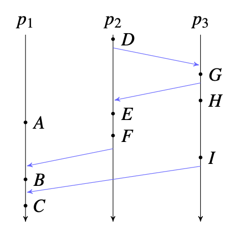

# Problem Set

## Question 1.
1. Suppose we have the following space-time diagram describing an execution of a distributed system (time advances downwards).

(a) For event F, partition the other events (A, B, C, D, E, G, H, and I) into those that happen before F, those that happen after F, and those that are concurrent with F.

(b) Assume that each process maintains a logical clock. Each clock starts at 0 and is updated at each labeled event, at each message send, and at each message receive. Give the clock value corresponding to each event. (Hint: D has timestamp 1 and G has timestamp
4.)

(c) Assume instead that each process maintains a vector clock. Give the clock values corresponding to each event. (Hint: G has timestamp {p1 : 0, p2 : 2, p3 : 2}.)

## Question 2.
2. In a sentence, explain why the constraint is needed; that is, why a violation of the following constraint would cause a problem.

(a) State transfer from primary to backup must include metadata on which requests have received replies, and what the response was.

(b) The backup must accept a request forwarded by the primary if and only if the
request and the backup have the same notion of the current view.

(c) Even on a read-only request, the primary must wait for the backup to accept the request before the primary can reply to the client.

## Question 3.
3. Suppose we have set of servers, clients, and a view server all running a correct version of the primary/backup protocol. In particular, suppose there are exactly two clients, both of which send one command, Append("foo", "x"), and then halt. The network is completely asynchronous.

(a) For each of the following predicates, indicate whether they could be true of a consistent global state in any possible execution.

i. Two different servers report currently being primary.

ii. The backup for view v reports having accepted a request from the primary
in view v, while the primary has not yet entered view v (or any later view).

iii. One client has received a reply to its command, while the other has not.

iv. Both clients report receiving AppendReply("x").

(b) Now, instead consider a global state gathered by a monitor using the following procedure:

- The monitor node sends a SNAPSHOT message to all other nodes.
- Upon receiving SNAPSHOT, each node sends its state to the monitor.
- After the monitor receives the states of all nodes, it combines them to form a global
state of the system.

For each of the following predicates, indicate whether they could be true of a global state gathered in this way.

i. Two different servers report currently being primary.

ii. The backup for view v reports having accepted a request from the primary in view v, while the view server has not yet received an acknowledgement for view v.

iii. One client has received a reply to its command, while the other has not.

iv. Both clients report receiving AppendReply("x").